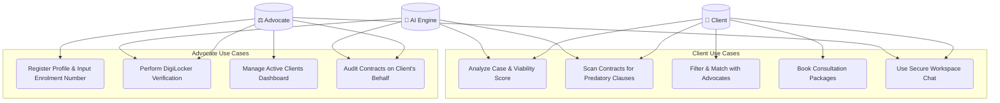
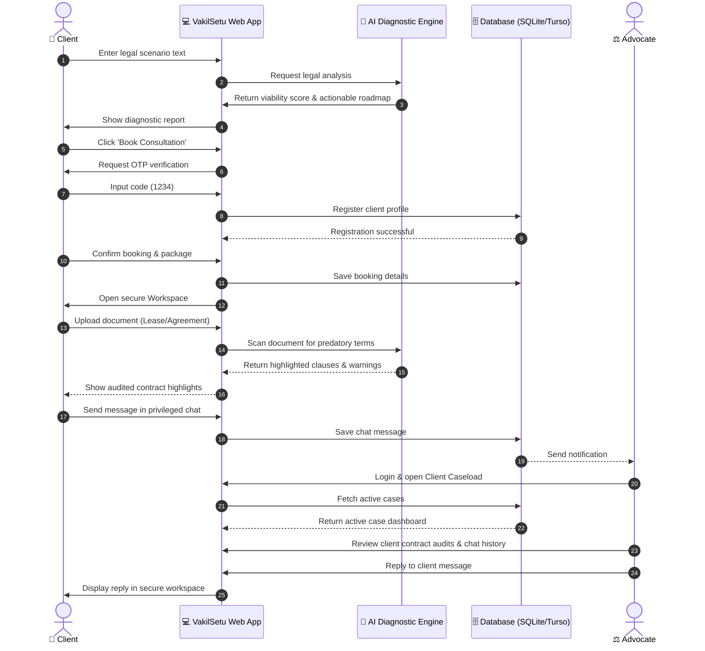

# Use-Case & Process Flow Diagrams: VakilSetu

This document contains visual diagrams for the **VakilSetu** platform, including a **Use-Case Diagram** and a **Process Flow Diagram (Sequence Flow)**, rendered in Mermaid syntax.

---

## 1. Use-Case Diagram
This diagram represents the actors (Client, Advocate, AI Engine) and their interactions with the key functionalities of the system.

---

## 2. Process Flow Diagram (Sequence Flow)
This diagram illustrates the step-by-step interactive workflow of a client diagnosing a dispute, booking an advocate, and collaborating inside the workspace.

