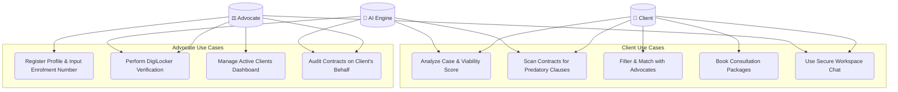
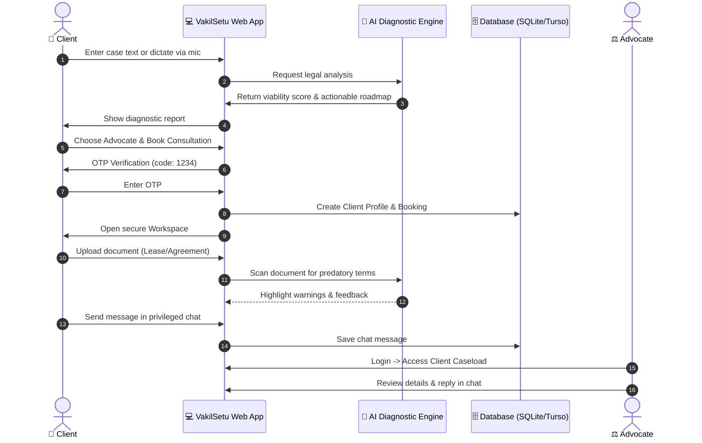

# Presentation Pitch Deck: VakilSetu

This outline maps out the slides for your pitch deck, matching the exact format of the 10-slide template provided in your screenshots.

---

### Slide 1: Title Slide
* **Theme / Background:** Coderush 2.0 Hackathon Title Image
* **Team Name:** `[Enter your Team Name]`
* **Team Leader Name:** `[Enter Team Leader Name]`
* **Problem Statement:** Legal assistance is inaccessible to the general public due to complex legal jargon, unpredictable billing, difficulty finding the correct specialty advocate, and lack of verifiable licensing/credibility checks.

---

### Slide 2: Team Members
* **Team Leader:**
  * **Name:** `[Enter Name]`
  * **College:** `[Enter College Name]`
  * **LinkedIn:** `[Enter Profile Link]`
* **Team Member 1:**
  * **Name:** `[Enter Name]`
  * **College:** `[Enter College Name]`
  * **LinkedIn:** `[Enter Profile Link]`
* **Team Member 2:**
  * **Name:** `[Enter Name]`
  * **College:** `[Enter College Name]`
  * **LinkedIn:** `[Enter Profile Link]`
* **Team Member 3:**
  * **Name:** `[Enter Name]`
  * **College:** `[Enter College Name]`
  * **LinkedIn:** `[Enter Profile Link]`
* **Team Member 4:**
  * **Name:** `[Enter Name]`
  * **College:** `[Enter College Name]`
  * **LinkedIn:** `[Enter Profile Link]`

---

### Slide 3: Brief about the Idea
* **Core Concept:** **VakilSetu** is a premium legal tech web application that makes legal help findable, trustworthy, and usable for first-time clients.
* **Key Modules:**
  * **AI Case Analyzer & Voice Intake:** Instantly evaluates legal disputes in English, Hindi, and Marathi, generating a viability score, filing cost estimate, and litigation checklist.
  * **Advocate Matchmaker:** Filters verified lawyers with transparent, flat-rate pricing models and verified public case histories.
  * **Encrypted Case Workspace:** Collaborative portal providing secure client-lawyer chat, interactive roadmap tracking, and an **AI Clause Auditor** that highlights predatory terms in lease/freelance contracts.
  * **Verified Trust Gateway:** Validates State Bar Council registration numbers and verifies credentials via DigiLocker.

---

### Slide 4: Opportunity & USP
* **How different is it from other existing ideas?**
  * Existing directories just list lawyers' phone numbers without upfront pricing or vetting. VakilSetu acts as an interactive client intake platform where users can evaluate their cases *before* contacting advocates, utilizing custom roadmaps and real-time document analysis.
* **How will it be able to solve the problem?**
  * **Removes Jargon:** Translates complex contract clauses and court processes into plain English.
  * **Ensures Price Transparency:** Removes unpredictable hourly fees in favor of clear, upfront flat-rate packages.
  * **Builds Unconditional Trust:** Integrates government APIs (DigiLocker) and double-checks claims using AI sanity models.
* **USP of the proposed solution:**
  * **End-to-End Legal Diagnostic Portal:** Fuses multilingual voice intake, interactive timeline templates, automated legal Notice drafting advice, and active client caseload dashboards into one unified Single-Page Application.

---

### Slide 5: Process Flow & Use-Case Diagrams

#### A. Use-Case Diagram


#### B. Process Flow Sequence Diagram


---

### Slide 6: Wireframes / Mock Layouts
* **Layout Design System:** Slate dark-mode backdrop with glassmorphic cards and cyan/orange/terracotta neon accents.
* **Component Wireframes:**
  1. **Intake / Welcome Screen:** Multilingual voice recorder button inside the case textarea, prompt chips below, and city/budget selectors.
  2. **Case Analyzer Output:** Gauge ring illustrating the viability percentage, diagnostic details, and cost estimates.
  3. **Advocate Matching Cards:** Terrazzo-bordered folder cards listing details, pricing tiers, experience badges, and expandable past case history.
  4. **Workspace split view:** Secure messaging dashboard on the left; Document auditing panels and roadmap progress timeline on the right.

---

### Slide 7: Technical Architecture Diagram
```mermaid
graph LR
    subgraph Frontend Client (SPA)
        UI[index.html / app.js / styles.css]
        WebSpeech[Web Speech API - Mic Input]
    end
    
    subgraph Server (Backend Node/Express)
        ServerJS[server.js]
        Routes[API Routes /api/*]
        Controllers[Controllers Logic]
    end
    
    subgraph Database & Services
        Turso[SQLite / Turso DB]
        Anthropic[Anthropic Claude API - Case Intake & Auditing]
    end

    UI <-->|HTTPS / REST API| ServerJS
    WebSpeech -->|Speech-to-Text| UI
    ServerJS --> Routes
    Routes --> Controllers
    Controllers <-->|SQL queries| Turso
    Controllers <-->|HTTP POST Requests| Anthropic
```

---

### Slide 8: Technologies Used
* **Frontend:** HTML5, Vanilla CSS3 (Slate dark mode, glassmorphic layout, custom animations), Vanilla ES6 JavaScript.
* **Backend:** Node.js, Express.js framework.
* **Database:** SQLite / LibSQL client (integrated with Turso database cloud connection).
* **AI & Integration APIs:**
  * **Anthropic Claude API:** Drives natural language case assessments, package recommendations, and document auditing.
  * **Web Speech API (webkitSpeechRecognition):** Handles local, real-time voice-to-text intake.
* **Icons & Fonts:** Lucide icons, Google Fonts (`Fraunces` serif, `IBM Plex Mono`, `IBM Plex Sans`).

---

### Slide 9: Cost Analysis
* **Hosting & Deployment:**
  * Vercel Serverless Hosting (Free Hobby tier / $20/month team plan).
* **Database Hosting:**
  * Turso Database Cloud (Free Starter tier / $9/month launch plan).
* **LLM Engine Processing Cost:**
  * Pay-as-you-go Anthropic API token pricing:
    * Case Intake Analysis: ~$0.005 per intake.
    * Document Scanning Audit: ~$0.015 per file scan.
* **Overall Projected MVP Monthly Cost:** **$0 (utilizing free hobby tiers)**.

---

### Slide 10: Thank You
* **App Name:** VakilSetu: Legal Help Made Accessible
* **Contact Email:** `[Enter your Email]`
* **GitHub Repository:** https://github.com/Goldengrab/YCCE
* *National Level 24-HR Hackathon Coderush 2.0*
